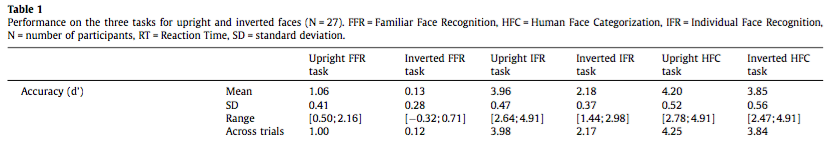

#### Article ID: KIUKz
#### Pilot: Maia ten Brink
#### Co-Pilot: Maya Mathur
#### Start date: Mar 25 2017
#### End date: Aug 9 2017
#### Final verification: Tom Hardwicke
#### Date: Nov 10 2017

-------


#### Methods summary: 

Participants completed three tasks: 1) a Familiar Face Recognition Task (FFR) in which famous faces were presented as targets and unknown faces as distractors; 2) a Human Face Categorization Task (HFC) in which human faces were presented as targets and animal faces as distractors; and 3) an Individual Face Recognition Task (IFR) in which different pictures of a single famous individual were presented as targets and unknown faces as distractors. 

Each task consisted of a block of 140 stimuli presented upright, and a second block of 140 stimuli presented in an inverted orientation. No stimuli were repeated.

To assess recognition, each block involved a Speed and Accuracy Boosting (SAB) procedure to force participants to use their fastest strategy and boost accuracy. This involved a Go/No-Go type paradigm in which participants had to respond whether they recognized the stimulus as the target before 600 ms, but had to inhibit response if the stimulus was not the target. If participants responded before the response deadline, they received positive audio feedback indicating whether it was a hit (correct: target) or negative audio feedback indicating a false alarm (incorrect: distractor). If they did not respond before the 600 ms deadline, they received positive audio feedback if the item was a distractor (correct rejection) or target (miss). Prior to each task, participants trained on a block of 20 targets and 20 distractors.

------

#### Target outcomes: 

Findings reported in section 3.1: Across-participants accuracy. 
> "A repeated measures two-way ANOVA on accuracy with task and orientation as factors revealed a clear main effect of the task (F(2, 22) = 784.6; p < 0.0005) and of the orientation (F(1, 23) = 402.3; p < 0.0005), as well as a significant interaction between them (F(2, 22) = 60.2; p < 0.0005). Accuracy was smaller in the Familiar Face Recognition condition than in the Individual Face Recognition, which itself was smaller than in the Human Face Categorization. The Familiar Face Recognition was much more difficult than the Individual Face Recognition and Human Face Categorization and not every participant succeeded on the task. In the upright condition, three participants did not succeed on the Familiar Face Recognition and were thus discarded from the study, while in the inverted condition only a few succeeded at this condition. Furthermore, the effect of inversion was computed (i.e. the difference between inverted face accuracy and upright faces accuracy divided by the upright faces accuracy; e.g. Russell, Duchaine, & Nakayama, 2009) and showed a significant difference between the three task (F(2, 22) = 151.4; p < 0.0005). Post-hoc analyses showed that this effect was larger in the Familiar Face Recognition than in the Individual Face Recognition (Familiar Face Recognition: 88.1%, SD = 29.6%; Individual Face Recognition: 44.5%, SD = 9.9%; p < 0.0005), which itself was larger than in the Human Face Categorization (8.1%, SD = 10.7%; p < 0.0005)." (Besson et al., p. 37).

------

```{r global_options, include=FALSE}
knitr::opts_chunk$set(echo=TRUE, warning=FALSE, message=FALSE)

# prepare an empty report object, we will update this each time we run compareValues2()
reportObject <- data.frame("Article_ID" = NA, "valuesChecked" = 0, "eyeballs" = 0, "Total_df" = 0, "Total_p" = 0, "Total_mean" = 0, "Total_sd" = 0, "Total_se" = 0, "Total_ci" = 0, "Total_bf" = 0, "Total_t" = 0, "Total_F" = 0, "Total_es" = 0, "Total_median" = 0, "Total_irr" = 0, "Total_r" = 0, "Total_z" = 0, "Total_coeff" = 0, "Total_n" = 0, "Total_x2" = 0, "Total_other" = 0, "Insufficient_Information_Errors" = 0, "Decision_Errors" = 0, "Major_Numerical_Errors" = 0, "Minor_Numerical_Errors" = 0, "Major_df" = 0, "Major_p" = 0, "Major_mean" = 0, "Major_sd" = 0, "Major_se" = 0, "Major_ci" = 0, "Major_bf" = 0, "Major_t" = 0, "Major_F" = 0, "Major_es" = 0, "Major_median" = 0, "Major_irr" = 0, "Major_r" = 0, "Major_z" = 0, "Major_coeff" = 0, "Major_n" = 0, "Major_x2" = 0, "Major_other" = 0, "affectsConclusion" = NA, "error_typo" = 0, "error_specification" = 0, "error_analysis" = 0, "error_data" = 0, "error_unidentified" = 0, "Author_Assistance" = NA, "resolved_typo" = 0, "resolved_specification" = 0, "resolved_analysis" = 0, "resolved_data" = 0, "correctionSuggested" = NA, "correctionPublished" = NA)
```

## Step 1: Load packages

```{r}
library(tidyverse) # for data munging
library(tidyr)
library(dplyr) # for working with dataframes
library(tibble)
library(knitr) # for kable table formating
library(haven) # import and export 'SPSS', 'Stata' and 'SAS' Files
library(readxl) # import excel files
library(CODreports) # custom report functions
library(ggthemes)
library(lme4)
library(lmerTest)
library(afex) # for anova
```

## Step 2: Load data

```{r}
raw_data = read_excel("data/data.xlsx")

# check number of subjects
dim( unique(raw_data[,1]) )
# 28 vs. 27 in paper (due to later exclusion)
```


## Step 3: Tidy data

```{r}
tidy_data <- raw_data %>%
  select(-Columns, -Notes,-StimuliSet) %>%  # remove some variables
  transform(InvCond = factor(InvCond, labels=c("Upright","Inverted"))) %>%
  rename(trial = Trial., subID = Part., cond = Cond., task_num = Task., lat = Lat.) %>%
  filter(is.na(Stimuli)==FALSE) %>%   #remove missing trials
  mutate(accuracy = NA)  # initialize empty accuracy variable

# sanity check: are accuracy components mutually exclusive in original data?
d = data.frame(raw_data)
table(d$Hit, d$FA, d$CR, d$Missed)
# yes

# make accuracy variable: each trial can be a hit, FA, CR, or miss
for (p in 1:dim(tidy_data)[1]) {
  if (tidy_data$Hit[p] == 1) {
    tidy_data$accuracy[p] = "Hit"
  }
  if (tidy_data$FA[p] == 1) {
    tidy_data$accuracy[p] = "FalseAlarm"
  }
  if (tidy_data$CR[p] == 1) {
    tidy_data$accuracy[p] = "CorrectRejection"
  }
  if (tidy_data$Missed[p] == 1) {
    tidy_data$accuracy[p] = "Missed"
  }
}  

tidy_data <- tidy_data %>%
  # remove some variables
  select (-Hit, -FA, -CR, -Missed, -Hits.RT, -FAs.RT) %>%
  # cast the string variables as factors
  transform(Task = factor(Task), InvCond = factor(InvCond), subID = factor(subID))
```

## Step 4: Run analysis

### Pre-processing

Discrimination index (d'), i.e. accuracy, was calculated according to ![Snodgrass & Corwin (1988)] (http://wixtedlab.ucsd.edu/publications/Psych%20218/Snodgrass_Corwin_1988.pdf) (Besson et al., p. 36). 

Discrimination index:
$$d' = z_H - z_F$$

where $z_F$ = z-score of false alarm rate and $z_H$ is the z-score of hit rate

The effect of inversion was computed by calculating the difference between inverted face accuracy and upright faces accuracy divided by the upright faces accuracy.

In the upright condition, three participants did not succeed on the Familiar Face Recognition task (hit rate = 0) and were thus discarded from the study.

```{r}
library(data.table)
dt = data.table(tidy_data)

##### Subject-Specific Hit And FA Rates #####
dt[, n.targets := sum( ExpectedResp, na.rm=TRUE ), by=list( subID, Task, InvCond ) ]
dt[, n.hits := sum( accuracy=="Hit" ), by=list( subID, Task, InvCond ) ]
dt[, hit.rate := n.hits/n.targets, by=list( subID, Task, InvCond ) ]
# this matches author's calculation of 50/70 for first cell and subject 1

# false-alarm rates
dt[, n.distr := sum( ExpectedResp==0, na.rm=TRUE ), by=list( subID, Task, InvCond ) ]
dt[, n.fa := sum( accuracy=="FalseAlarm" ), by=list( subID, Task, InvCond ) ]
dt[, fa.rate := n.fa/n.distr, by=list( subID, Task, InvCond ) ]

# Snodgrass versions for later calculation of d'
dt[, hit.rate.c := (n.hits+0.5)/(n.targets+1), by=list( subID, Task, InvCond ) ]
dt[, fa.rate.c := (n.fa+0.5)/(n.distr+1), by=list( subID, Task, InvCond ) ]


##### Average Hit Rates By Task and Inversion #####

# dt2: keep only 1 row per subject, 1 for each task and inversion combination
# hackily make a variable that's unique for each of those combos
dt$temp = paste( dt$subID, dt$Task, dt$InvCond )
dt2 = dt[ !duplicated(dt$temp), ]
dim(dt2)
# indeed, this has 27*2*3 rows
# these hit and FA rates match the originals :) 


##### D-Prime By Subject #####
# Z-score, unpooled
# passed arguments should already have Snodgrass correction
dprime = function(f, h){
  return( -qnorm(f) + qnorm(h) )
}

# ref: https://cogsci.stackexchange.com/questions/6302/two-different-values-for-criterion-in-signal-detection-theory
cbias = function( f, h ){
  return( -0.5 * ( qnorm(f) + qnorm(h) ) )
}

dt2[, d := dprime( f=fa.rate.c, h=hit.rate.c ) ]
# these also match! :D


##### Response Bias (C) By Subject #####
dt2[, C := cbias( f=fa.rate.c, h=hit.rate.c ) ]
# these also match! :D


##### "Success" By Subject #####
# not sure, but I assume they use the uncorrected hit and fa rates here
# pass the raw numbers of FAs, hits, and denominators for each
# return binary result of 2-sided, 2-sample Z-test
succeeded = Vectorize( function( f.count, h.count, nf, nh ){
  return( prop.test( x=c(f.count, h.count), n=c(nf, nh) )$p.value < 0.05 )
}, vectorize.args=c("f.count", "h.count", "nf", "nh") )

dt2$success = succeeded( f.count=dt2$n.fa, h.count=dt2$n.hits, nf=dt2$n.distr, nh=dt2$n.targets )

# look at success by condiiton
aggregate( success ~ Task + InvCond, dt2, sum)
# indeed, 3 subjects failed

# subjects to exclude
excl.ids = dt2[ dt2$Task=="FFR" & dt2$InvCond=="Upright" & dt2$success==0,]$subID

# exclude them
dt2 = dt2[ !dt2$subID %in% excl.ids, ]


##### Accuracy as Percent #####
d3 = data.frame(dt2)
d3 = d3[ , names(d3) %in% c("subID", "InvCond", "Task", "d") ]


d_inv <- d3 %>%
  group_by(Task, subID, InvCond) %>%
  spread(InvCond, d) %>%
  mutate(inv.eff = (Upright - Inverted)/Upright) #effect of inversion on accuracy

# sanity check: compare to Fig 2B
aggregate( inv.eff ~ Task, data = d_inv, median )

```


### Descriptive statistics

The mean and standard deviations of d' and of effect of inversion were calculated.

```{r}
# means and sds by condition
aggregate( d ~ Task + InvCond, dt2, mean)
aggregate( d ~ Task + InvCond, dt2, sd)
```

These descriptive statistics appear to match the reported descriptive statistics: 



Let's check explictly:

```{r}
###FFR
##Upright
#mean:
reportObject <- compareValues2(reportedValue = "1.06", obtainedValue = 1.06, valueType = 'mean')
#stdev:
reportObject <- compareValues2(reportedValue = "0.41", obtainedValue = 0.41, valueType = 'sd')
##Inverted
#mean:
reportObject <- compareValues2(reportedValue = ".13", obtainedValue = 0.13, valueType = 'mean')
#stdev:
reportObject <- compareValues2(reportedValue = ".28", obtainedValue = 0.28, valueType = 'sd')

###HFC
##Upright
#mean:
reportObject <- compareValues2(reportedValue = "4.20", obtainedValue = 4.20, valueType = 'mean')
#stdev:
reportObject <- compareValues2(reportedValue = "0.52", obtainedValue = 0.52, valueType = 'sd')
##Inverted
#mean:
reportObject <- compareValues2(reportedValue = "3.85", obtainedValue = 3.85, valueType = 'mean')
#stdev:
reportObject <- compareValues2(reportedValue = "0.56", obtainedValue = 0.56, valueType = 'sd')

###IFR
##Upright
#mean:
reportObject <- compareValues2(reportedValue = "3.96", obtainedValue = 3.96, valueType = 'mean')
#stdev:
reportObject <- compareValues2(reportedValue = "0.47", obtainedValue = 0.47, valueType = 'sd')
##Inverted
#mean:
reportObject <- compareValues2(reportedValue = "2.18", obtainedValue = 2.18, valueType = 'mean')
#stdev:
reportObject <- compareValues2(reportedValue = "0.37", obtainedValue = 0.37, valueType = 'sd')
```

### Inferential statistics

> A repeated measures two-way ANOVA on accuracy with task and orientation as factors revealed a clear main effect of the task (F(2, 22) = 784.6; p < 0.0005) and of the orientation (F(1, 23) = 402.3; p < 0.0005), as well as a significant interaction between them (F(2, 22) = 60.2; p < 0.0005).

```{r}
aov.out <- aov_ez(data = dt2, id = "subID", within = c("Task", "InvCond"), dv = "d", anova_table = list(correction = "none", es = "pes"), type = "III")

# compare values
reportObject <- compareValues2(reportedValue="2", obtainedValue=aov.out$anova_table$`num Df`[1], valueType = 'df')
reportObject <- compareValues2(reportedValue="22", obtainedValue=aov.out$anova_table$`den Df`[1], valueType = 'df')
reportObject <- compareValues2(reportedValue="784.6", obtainedValue=aov.out$anova_table$F[1], valueType = 'F')
reportObject <- compareValues2(reportedValue="eyeballMATCH", obtainedValue=aov.out$anova_table$`Pr(>F)`[1], valueType = 'p')

reportObject <- compareValues2(reportedValue="1", obtainedValue=aov.out$anova_table$`num Df`[2], valueType = 'df')
reportObject <- compareValues2(reportedValue="23", obtainedValue=aov.out$anova_table$`den Df`[2], valueType = 'df')
reportObject <- compareValues2(reportedValue="402.3", obtainedValue=aov.out$anova_table$F[2], valueType = 'F')
reportObject <- compareValues2(reportedValue="eyeballMATCH", obtainedValue=aov.out$anova_table$`Pr(>F)`[2], valueType = 'p')

reportObject <- compareValues2(reportedValue="2", obtainedValue=aov.out$anova_table$`num Df`[3], valueType = 'df')
reportObject <- compareValues2(reportedValue="22", obtainedValue=aov.out$anova_table$`den Df`[3], valueType = 'df')
reportObject <- compareValues2(reportedValue="60.2", obtainedValue=aov.out$anova_table$F[3], valueType = 'F')
reportObject <- compareValues2(reportedValue="eyeballMATCH", obtainedValue=aov.out$anova_table$`Pr(>F)`[3], valueType = 'p')
```

>the effect of inversion was computed (i.e. the difference between inverted face accuracy and upright faces accuracy divided by the upright faces accuracy; e.g. Russell, Duchaine, & Nakayama, 2009) and showed a significant difference between the three task (F(2, 22) = 151.4; p < 0.0005).

```{r}
aov.out <- aov_ez(d = d_inv, id = 'subID', dv = "inv.eff", within = 'Task', anova_table = list(correction = "none", es = "pes"), type = "III")

reportObject <- compareValues2(reportedValue = "2", obtainedValue = aov.out$anova_table$`num Df`, valueType = 'df')
reportObject <- compareValues2(reportedValue = "22", obtainedValue = aov.out$anova_table$`den Df`, valueType = 'df')
reportObject <- compareValues2(reportedValue = "151.4", obtainedValue = aov.out$anova_table$F, valueType = 'F')
reportObject <- compareValues2(reportedValue = "eyeballMATCH", obtainedValue = aov.out$anova_table$`Pr(>F)`, valueType = 'p')
```


```{r}
ggplot(data=dt2,
  aes(x = InvCond, y = d, color = Task)) +
  geom_boxplot(notch=TRUE) +
  geom_point(shape=21, position=position_dodge(width=0.75)) +
  ggthemes::theme_few() +
  xlab("Position") +
  ylab("Accuracy (d')")

ggplot(data=d_inv,
  aes(x = Task, y = inv.eff, color = Task))+
  geom_boxplot(notch=TRUE) +
  geom_point(shape=21, position=position_dodge(width=0.75)) +
  ggthemes::theme_few() +
  xlab("Task Condition") +
  ylab("% Accuracy on Inverted Faces")
```


## Step 5: Conclusion

I initially could not reproduce the by-participant dataset from the by-trial data, but after contacting the author and receiving a prompt reply, I could exactly reproduce the by-participant dataset and corresponding descriptive statistics. The procedures I had done incorrectly were perhaps not entirely detailed in the paper, but I suspect that a reader with background in signal detection theory would have understood these procedures as standard practice. 

Results of the two main analyses and corresponding marginal means yielded effect sizes similar to those in the original paper, but that differed numerically. F-statistics were sometimes substantially different, although direct comparison is difficult because our analyses also differed on degrees of freedom. We followed up with the authors a second time to address these issues but received no response to our initial e-mail or a 2 week follow up reminder. As the issues cannot be resolved, this reproducibility check has to be marked as a failure depsite author assistance.

```{r}
reportObject$Article_ID <- "KIUKz"
reportObject$affectsConclusion <- "no"
reportObject$error_typo <- 0
reportObject$error_specification <- 
reportObject$error_analysis <- 0
reportObject$error_data <- 0
reportObject$error_unidentified <- 1
reportObject$Author_Assistance <- T
reportObject$resolved_typo <- 0
reportObject$resolved_specification <- 1
reportObject$resolved_analysis <- 0
reportObject$resolved_data <- 0
reportObject$correctionSuggested <- F
reportObject$correctionPublished <- NA

# decide on final outcome
if(reportObject$Decision_Errors > 0 | reportObject$Major_Numerical_Errors > 0 | reportObject$Insufficient_Information_Errors > 0){
  reportObject$finalOutcome <- "Failure"
  if(reportObject$Author_Assistance == T){
    reportObject$finalOutcome <- "Failure despite author assistance"
  }
}else{
  reportObject$finalOutcome <- "Success"
  if(reportObject$Author_Assistance == T){
    reportObject$finalOutcome <- "Success with author assistance"
  }
}

# save the report object
filename <- paste0("reportObject_", reportObject$Article_ID,".csv")
write_csv(reportObject, filename)
```

## Report Object

```{r, echo = FALSE}
# display report object in chunks
kable(reportObject[2:10], align = 'l')
kable(reportObject[11:20], align = 'l')
kable(reportObject[21:25], align = 'l')
kable(reportObject[26:30], align = 'l')
kable(reportObject[31:35], align = 'l')
kable(reportObject[36:40], align = 'l')
kable(reportObject[41:45], align = 'l')
kable(reportObject[46:51], align = 'l')
kable(reportObject[52:57], align = 'l')
```

## Session information

```{r session_info, include=TRUE, echo=TRUE, results='markup'}
devtools::session_info()
```
