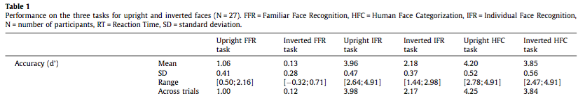

#### Article ID: KIUKz
#### Pilot: Maia ten Brink
#### Co-Pilot: Maya Mathur
#### Start date: 03/25/17
#### End date: 03/27/2017 

-------

#### Methods summary: 

Participants completed three tasks: 1) a Familiar Face Recognition Task (FFR) in which famous faces were presented as targets and unknown faces as distractors; 2) a Human Face Categorization Task (HFC) in which human faces were presented as targets and animal faces as distractors; and 3) an Individual Face Recognition Task (IFR) in which different pictures of a single famous individual were presented as targets and unknown faces as distractors. 
Each task consisted of a block of 140 stimuli presented upright, and a second block of 140 stimuli presented in an inverted orientation. No stimuli were repated.

To assess recognition, each block involved a Speed and Accuracy Boosting (SAB) procedure to force participants to use their fastest strategy and boost accuracy. This involved a Go/No-Go type paradigm in which participants had to respond whether they recognized the stimulus as the target before 600 ms, but had to inhibit response if the stimulus was not the target. If participants responded before the response deadline, they received positive audio feedback indicating whether it was a hit (correct: target) or negative audio feedback indicating a false alarm (incorrect: distractor). If they did not respond before the 600 ms deadline, they received positive audio feedback if the item was a distractor (correct rejection) or target (miss). Prior to each task, participants trained on a block of 20 targets and 20 distractors.

------

#### Target outcomes: 

Findings reported in section 3.1: Across-participants accuracy. 
> "A repeated measures two-way ANOVA on accuracy with task and orientation as factors revealed a clear main effect of the task (F(2, 22) = 784.6; p < 0.0005) and of the orientation (F(1, 23) = 402.3; p < 0.0005), as well as a significant interaction between them (F(2, 22) = 60.2; p < 0.0005). Accuracy was smaller in the Familiar Face Recognition condition than in the Individual Face Recognition, which itself was smaller than in the Human Face Categorization. The Familiar Face Recognition was much more difficult than the Individual Face Recognition and Human Face Categorization and not every participant succeeded on the task. In the upright condition, three participants did not succeed on the Familiar Face Recognition and were thus discarded from the study, while in the inverted condition only a few succeeded at this condition. Furthermore, the effect of inversion was computed (i.e. the difference between inverted face accuracy and upright faces accuracy divided by the upright faces accuracy; e.g. Russell, Duchaine, & Nakayama, 2009) and showed a significant difference between the three task (F(2, 22) = 151.4; p < 0.0005). Post-hoc analyses showed that this effect was larger in the Familiar Face Recognition than in the Individual Face Recognition (Familiar Face Recognition: 88.1%, SD = 29.6%; Individual Face Recognition: 44.5%, SD = 9.9%; p < 0.0005), which itself was larger than in the Human Face Categorization (8.1%, SD = 10.7%; p < 0.0005)." (Besson et al., p. 37).

------

```{r global_options, include=FALSE}
require(knitr)
knitr::opts_chunk$set(echo=TRUE, warning=FALSE, message=FALSE)
```

## Step 1: Load packages

```{r}
library(tidyverse) # for data munging
library(tidyr)
library(dplyr) # for working with dataframes
library(tibble)
library(knitr) # for kable table formating
library(haven) # import and export 'SPSS', 'Stata' and 'SAS' Files
library(readxl) # import excel files
library(CODreports) # custom report functions
library(ggthemes)
library(lme4)
library(lmerTest)
```

## Step 2: Load data

```{r}
raw_data = read_excel("data.xlsx")

# check number of subjects
dim( unique(raw_data[,1]) )
# 28 vs. 27 in paper
```

## Step 3: Tidy data

```{r}
tidy_data <- raw_data %>%
  select(-Columns, -Notes,-StimuliSet) %>%  # remove some variables
  transform(InvCond = factor(InvCond, labels=c("Upright","Inverted"))) %>%
  rename(trial = Trial., subID = Part., cond = Cond., task_num = Task., lat = Lat.) %>%
  filter(is.na(Stimuli)==FALSE) %>%   #remove missing trials
  mutate(accuracy = NA)  # initialize empty accuracy variable

# MM: check whether accuracy components are mutually exclusive in original data
d = data.frame(raw_data)
table(d$Hit, d$FA, d$CR, d$Missed)
# yes

# make accuracy variable: each trial can be a hit, FA, CR, or miss
for (p in 1:dim(tidy_data)[1]) {
  if (tidy_data$Hit[p] == 1) {
    tidy_data$accuracy[p] = "Hit"
  }
  if (tidy_data$FA[p] == 1) {
    tidy_data$accuracy[p] = "FalseAlarm"
  }
  if (tidy_data$CR[p] == 1) {
    tidy_data$accuracy[p] = "CorrectRejection"
  }
  if (tidy_data$Missed[p] == 1) {
    tidy_data$accuracy[p] = "Missed"
  }
}  

tidy_data <- tidy_data %>%
  # remove some variables
  select (-Hit, -FA, -CR, -Missed, -Hits.RT, -FAs.RT) %>%
  # cast the string variables as factors
  transform(Task = factor(Task), InvCond = factor(InvCond), subID = factor(subID))

```

## Step 4: Run analysis

### Pre-processing

Discrimination index (d'), i.e. accuracy, was calculated according to ![Snodgrass & Corwin (1988)] (http://wixtedlab.ucsd.edu/publications/Psych%20218/Snodgrass_Corwin_1988.pdf) (Besson et al., p. 36). 
INSUFFICIENT INFORMATION ERROR: This equation had to be found in the cited Snodgrass paper; it was not detailed anywhere within this paper. 

Discrimination index:
$$d' = z_H - z_F$$

where $z_F$ = z-score of false alarm rate and $z_H$ is the z-score of hit rate

The effect of inversion was computed by calculating the difference between inverted face accuracy and upright faces accuracy divided by the upright faces accuracy.

In the upright condition, three participants did not succeed on the Familiar Face Recognition task (hit rate = 0) and were thus discarded from the study.

```{r}
d_dprime <- tidy_data %>%
  group_by(Task, InvCond, subID) %>%
  summarise(total_H = sum(accuracy=="Hit"), total_FA = sum(accuracy=="FalseAlarm"), total_CR = sum(accuracy=="CorrectRejection"), total_M = sum(accuracy=="Missed")) %>%
  mutate(total = 140) %>% #140 trials per block
  mutate(H_rate = total_H/total, FA_rate = total_FA/total) %>% #calculate H and FA rates
  filter(H_rate > 0.02) %>% #remove participants who were unsuccessful at FFR task
  mutate(H_rate_z = (H_rate - mean(H_rate))/sd(H_rate)) %>% #z-score H rate
  mutate(FA_rate_z = (FA_rate - mean(FA_rate))/sd(FA_rate)) %>% #z-score FA rate
  mutate(dprime = H_rate_z - FA_rate_z) %>% #calculate d' (TEST VERSION)
  mutate(dprime = H_rate_z - FA_rate_z) %>% #calculate d' 
  group_by(subID, Task, InvCond)

d_inv <- d_dprime %>%
  group_by(Task, subID, InvCond) %>%
  summarise(mean_dprime = mean(dprime)) %>%
  spread(InvCond,mean_dprime) %>%
  mutate(inv_eff = (Upright - Inverted)/Upright) #effect of inversion on accuracy
```

### Descriptive statistics

The mean and standard deviations of d' and of effect of inversion were calculated.

```{r}
means_d_dprime <- d_dprime %>%
  group_by(Task, InvCond) %>%
  summarise(mean_dprime = mean(dprime,na.rm=TRUE), sd_dprime = sd(dprime, na.rm=TRUE))

print(means_d_dprime)

means_d_inv <- d_inv %>%
  group_by(Task) %>%
  summarise(mean_inveff = mean(inv_eff,na.rm=TRUE), sd_inveff = sd(inv_eff, na.rm=TRUE))

print(means_d_inv)
```

MAJOR NUMERICAL ERROR: These descriptive statistics do not corroborate the reported descriptive statistics:  (Besson et al., p. 37)

```{r}
###FFR
##Upright
#mean:
compareValues(reportedValue = 1.06, obtainedValue = 3.048044e-16)
#stdev:
compareValues(reportedValue = 0.41, obtainedValue = 1.0036151)
##Inverted
#mean:
compareValues(reportedValue = .13, obtainedValue = -2.775558e-17)
#stdev:
compareValues(reportedValue = .28, obtainedValue = 0.5215429)

###HFC
##Upright
#mean:
compareValues(reportedValue = 4.20, obtainedValue = 2.386980e-15)
#stdev:
compareValues(reportedValue = 0.52, obtainedValue = 1.5092765)
##Inverted
#mean:
compareValues(reportedValue = 3.85, obtainedValue = 1.204071e-15)
#stdev:
compareValues(reportedValue = 0.56, obtainedValue = 1.6299561)

###IFR
##Upright
#mean:
compareValues(reportedValue = 3.96, obtainedValue = -2.269275e-16)
#stdev:
compareValues(reportedValue = 0.47, obtainedValue = 1.4212695)
##Inverted
#mean:
compareValues(reportedValue = 2.18, obtainedValue = -2.754918e-16)
#stdev:
compareValues(reportedValue = 0.37, obtainedValue = 1.3595276)
```

### Inferential statistics

We ran two-way repeated measures ANOVA on accuracy (d') with task type and orientation as factors. (Because there was an imbalance in the orientation cells, we followed up with our own analysis, a linear mixed model.)
We also ran an ANOVA on % accuracy change with face orientation with task type as a factor.

```{r}
dprime.aov <- with(d_dprime,
                   aov(dprime ~ (Task * InvCond) +
                       Error(subID / (Task * InvCond))))
summary(dprime.aov)
# #Problem: nesting appeared unbalanaced due to some missing data from FFR Inverted, so I tried it as a linear mixed model:
# res2 = lmer(dprime ~ Task * InvCond + (1|subID), data=d_dprime)
# summary(res2)
# #result: No significant main or interaction fixed effects

dinv.aov <- with(d_inv,
                 aov(inv_eff ~ Task + Error (subID/Task)))
summary(dinv.aov)

ggplot(data=d_dprime,
  aes(x = InvCond, y = dprime, color = Task)) +
  geom_boxplot(notch=TRUE) +
  geom_point(shape=21, position=position_dodge(width=0.75)) +
  ggthemes::theme_few() +
  xlab("Position") +
  ylab("Accuracy (d')")

ggplot(data=d_inv,
  aes(x = Task, y = inv_eff, color = Task))+
  geom_boxplot(notch=TRUE) +
  geom_point(shape=21, position=position_dodge(width=0.75)) +
  ggthemes::theme_few() +
  xlab("Task Condition") +
  ylab("% Accuracy on Inverted Faces")

```

There was no significant main effect of either task (F(2,51) = 1.142, p = 0.29), a marginally significant effect of presentation orientation (F(1,25) = 4.076, p = 0.054), and no significant interaction between task and orientation (F(2,49) = 0.283, p = 0.755).
In the original study, however, 
>"a repeated measures two-way ANOVA on accuracy with task and orientation as factors revealed a clear main effect of the task (F(2, 22) = 784.6; p < 0.0005) and of the orientation (F(1, 23) = 402.3; p < 0.0005), as well as a significant interaction between them (F(2, 22) = 60.2; p < 0.0005). Accuracy was smaller in the Familiar Face Recognition condition than in the Individual Face Recognition, which itself was smaller than in the Human Face Categorization. The Familiar Face Recognition was much more difficult than the Individual Face Recognition and Human Face Categorization and not every participant succeeded on the task."

```{r}
compareValues(reportedValue = 0.0005, obtainedValue = 0.29, isP= T)
compareValues(reportedValue = 0.0005, obtainedValue = 0.054, isP = T)
compareValues(reportedValue = 0.0005, obtainedValue = 0.755, isP = T)
```

There was no significant difference in the effects of face inversion across the three tasks (F(2,49) = 0.496, p = 0.61), contrary to the original paper's findings, which
>"showed a significant difference between the three task (F(2, 22) = 151.4; p < 0.0005). Post-hoc analyses showed that this effect was larger in the Familiar Face Recognition than in the Individual Face Recognition (Familiar Face Recognition: 88.1%, SD = 29.6%; Individual Face Recognition: 44.5%, SD = 9.9%; p < 0.0005), which itself was larger than in the Human Face Categorization (8.1%, SD = 10.7%; p < 0.0005."
The range of affects of inversion on accuracy seemed to match the original paper somewhat, with the largest spread of values for percent accuracy of inversion in the Familiar Face Recognition Task.

```{r}
compareValues(reportedValue = 0.0005, obtainedValue = 0.61, isP= T)
```

## Step 5: Conclusion

```{r}
codReport(Report_Type = 'pilot',
          Article_ID = 'KIUKz', 
          Insufficient_Information_Errors = 1,
          Decision_Errors = 4, 
          Major_Numerical_Errors = 16, 
          Minor_Numerical_Errors = 0)
```

This reproducibility check was a failure. 
There was insufficient information to complete the analysis.
None of the effects or significance findings from the accuracy analysis detailed in Section 3.1 were reproduced in our analysis.
Some trends appeared to be reproduced: The range of affects of inversion on accuracy seemed to match the original paper somewhat, with the largest spread of values for percent accuracy of inversion in the Familiar Face Recognition Task.

One possible explanation is that d' may have been calculated differently in the original analysis from our replication. A reference was provided, but no actual equation for d' was specified. They may not have centered their hit and false alarm rates, or they may have calculated hit rates and false alarms rates by including correct rejections and misses (the method to calculate hit and false alarm rate was not clarified in the write-up).

Our figures do not reproduce the original paper's figures, and our calculated degrees of freedom for the ANOVAs were larger than the originals. This may be due to authors' unspecified exclusion of outliers.

It is my sense, however, that I have failed to appropriately reproduce their analysis in some way because of my own confusion about how to carry out their analytical method because of INCOMPLETE INFORMATION ERROR, rather than missing or excluded data.

```{r session_info, include=TRUE, echo=TRUE, results='markup'}
devtools::session_info()
```
